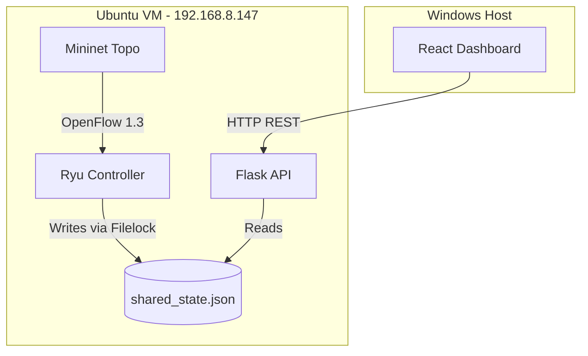

# SDN DDoS Mitigation Project

A comprehensive Software-Defined Networking (SDN) project that detects and mitigates Distributed Denial of Service (DDoS) attacks in real-time. Designed for an academic setting, this system utilizes a Ryu controller to collect OpenFlow statistics, applies Machine Learning (with a robust threshold fallback) to identify malicious traffic, immediately installs blocking rules on an OVS switch, and visualizes the network state on a React dashboard.

## Architecture Diagram



## Quick Start

### Ubuntu VM (Backend & Network)
Open 4 separate terminals and run:

**Terminal 1 (Mininet):**
```bash
sudo mn -c
sudo python3 network/topo.py
```

**Terminal 2 (Ryu Controller):**
```bash
source ryu39_env/bin/activate
ryu-manager controller/simple_monitor.py
```

**Terminal 3 (Flask API):**
```bash
source ryu39_env/bin/activate
cd backend_api
python3 app.py
```

**Terminal 4 (Legit Traffic):**
```bash
# In Mininet CLI:
mininet> xterm h1
# In h1 xterm:
./network/legit_traffic.sh
```

### Windows Host (Frontend)
Open 1 terminal in the project root:

```powershell
npm install
npm run dev
```

## Project Structure

```text
DDoS Mitigation/
├── backend_api/
│   ├── app.py                 # Flask REST API reading shared state
│   └── shared_state.json      # Inter-Process Communication state file
├── controller/
│   ├── simple_monitor.py      # Ryu app polling stats & driving logic
│   ├── mitigation.py          # Pushes OpenFlow DROP rules to switch
│   ├── inference_loader.py    # Loads ML model / threshold logic
│   └── traffic_dataset.csv    # Live traffic logging for datasets
├── docs/                      # Documentation folder
├── ml_pipeline/               # Scripts and notebooks for ML training
├── network/
│   ├── topo.py                # Mininet topology script (h1, h2, h3, s1)
│   └── *.sh                   # Traffic generation scripts
├── src/                       # React frontend source code (App.tsx, etc.)
└── README.md                  # This file
```

## How It Works

1. **Traffic Generation:** Mininet orchestrates endpoints. Legitimate traffic flows from `h1`, while attack traffic is flooded from `h2` towards `h3`.
2. **Statistics Collection:** The Ryu controller (`simple_monitor.py`) queries the OVS switch (`s1`) for flow statistics every 1.5 seconds.
3. **Detection:** Ryu uses an inference loader to classify traffic. Currently, it defaults to a threshold mechanism (if Packets Per Second > 10,000, it marks the flow as a DDoS attack).
4. **Mitigation & Visualization:** Upon detection, Ryu instructs `mitigation.py` to push a high-priority DROP rule to `s1`. Simultaneously, Ryu updates `shared_state.json`. Flask serves this updated state to the React dashboard, dynamically painting the UI red.

## Configuration

To configure the dashboard to point to your specific Ubuntu VM IP:
1. Copy `.env.example` to `.env` in the root directory.
2. Edit `.env` to set `VITE_DEFENSE_API_URL` to your Flask endpoint, e.g., `http://192.168.8.147:5000/api/network-stats`.

## Documentation Index

| Document | Description |
|---|---|
| [Architecture](docs/ARCHITECTURE.md) | Deep dive into system components, data flows, and state logic. |
| [API Schema](docs/API_SCHEMA.md) | Contract for the Flask REST API endpoints and data models. |
| [Demo Script](docs/DEMO_SCRIPT.md) | Step-by-step guide to showcasing the project in a presentation. |

## Team

| Role | Responsibility |
|---|---|
| **Lead** | Backend Architecture & Machine Learning Pipelines |
| **Friend 1** | Network Topology & Ryu Controller Logic |
| **Friend 2** | React Frontend Dashboard & Quality Assurance |

## Current Status

- **Implemented & Working:** Mininet network, Ryu controller, IPC state sharing, Flask API, React dashboard, automated mitigation rules.
- **Pending:** The ML model (`detector.joblib`) is not yet fully trained. The controller currently uses a resilient threshold fallback (PPS > 10,000) for detection.

*Last Updated: 2026-10-09*
