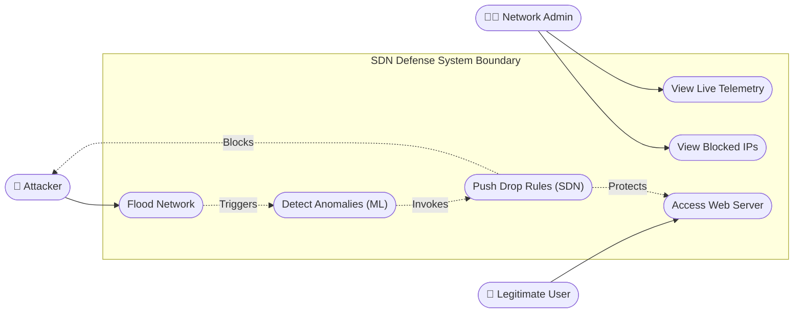
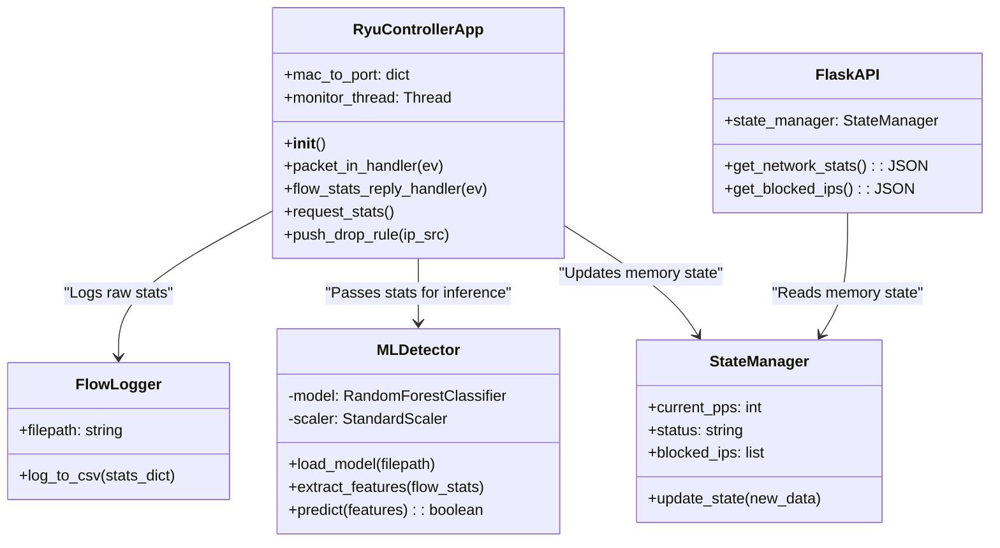
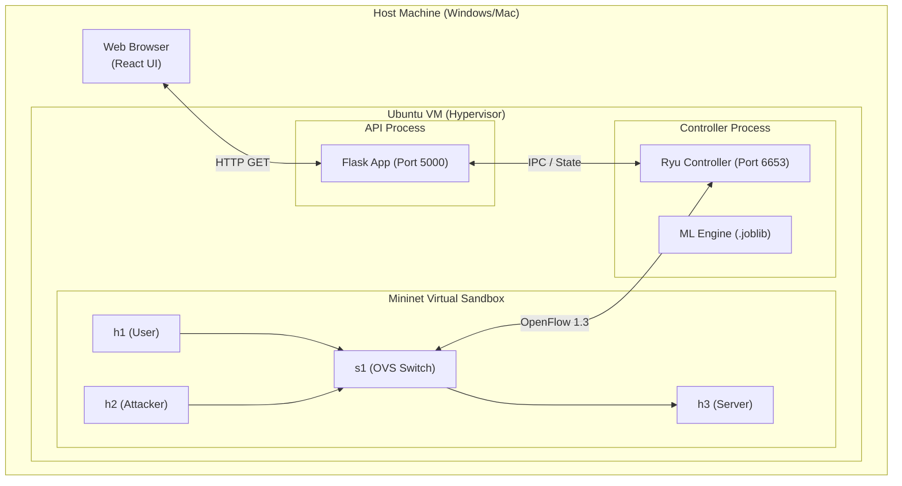
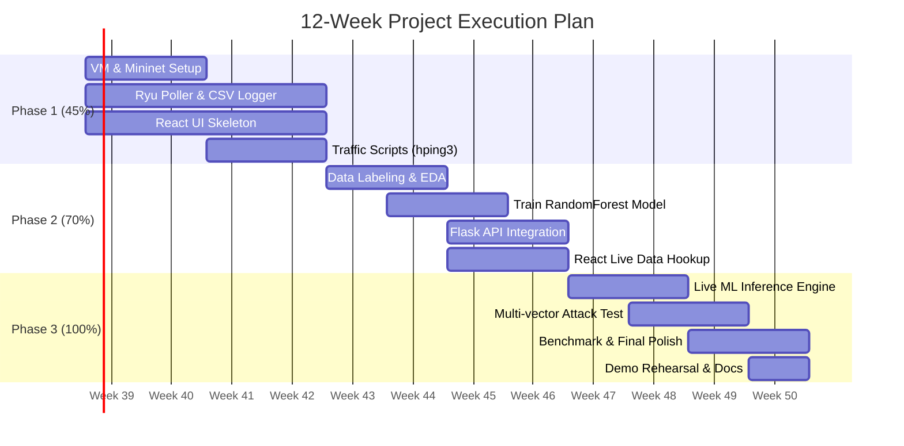

# Academic UML Diagrams & Risk Management
## SDN-Based DDoS Detection and Mitigation System

This document supplements the core architecture with formal UML diagrams and risk analysis typically required for academic evaluations and rigorous software engineering standards.

---

## 1. Additional UML Diagrams

### 1.1 Use Case Diagram
Maps the external actors to the system's core capabilities.

### 1.2 Class Diagram (Backend & ML)
Shows the object-oriented structure of the Controller and API layer.

### 1.3 Deployment Diagram
Maps software components to virtual/physical hardware.

### 1.4 Visual Project Timeline (Gantt Chart)

---

## 2. Risk Management & Threat Model

### 2.1 Technical Risks
| Risk Description | Probability | Impact | Mitigation Strategy |
|---|---|---|---|
| **Control Plane Saturation:** The flood of OpenFlow `Packet-In` messages overwhelms the Ryu controller before rules are pushed. | High | Critical | Implement proactive flow polling instead of relying solely on reactive `Packet-In` events. Limit polling frequency to 1.5s to save CPU. |
| **Model False Positives:** Legitimate heavy traffic (e.g., a file download) is misclassified as a DDoS attack. | Medium | High | Fine-tune the RandomForest threshold; ensure the dataset contains normal traffic bursts. Implement an auto-timeout for blocked IPs so false positives eventually recover. |
| **VM Resource Exhaustion:** Mininet, Ryu, Flask, and React running on one VM causes memory swapping and crashes. | Medium | High | Allocate minimum 4GB RAM / 2 vCPUs to the Ubuntu VM. Run the React frontend on the Host machine instead of the VM to save memory. |

### 2.2 Project Management Risks
| Risk Description | Mitigation Strategy |
|---|---|
| **Member Drops Out / Is Blocked:** | The `TEAM_PLAN.md` isolates dependencies through API contracts (`mockData.json`). If the backend is delayed, the frontend can still build UI. If ML is delayed, manual thresholds can trigger the mitigation rules as a fallback. |
| **ML Model Accuracy is Low:** | Switch to a simpler Decision Tree or a static math-based threshold (PPS > X) to ensure the system is demonstrable, then optimize ML later. |
