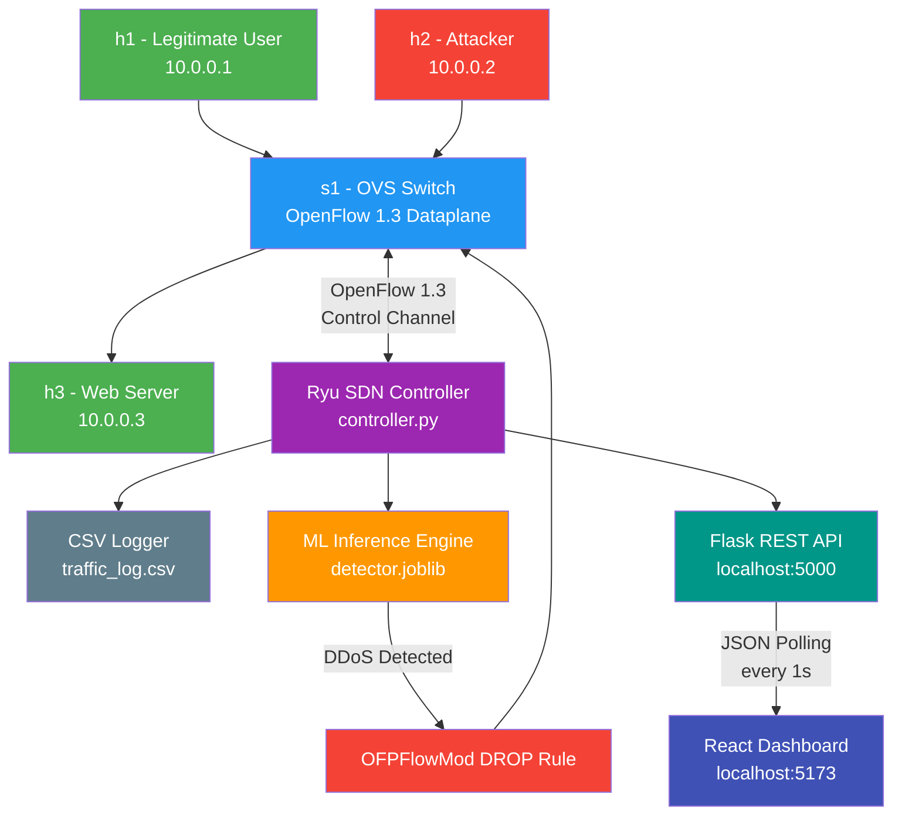
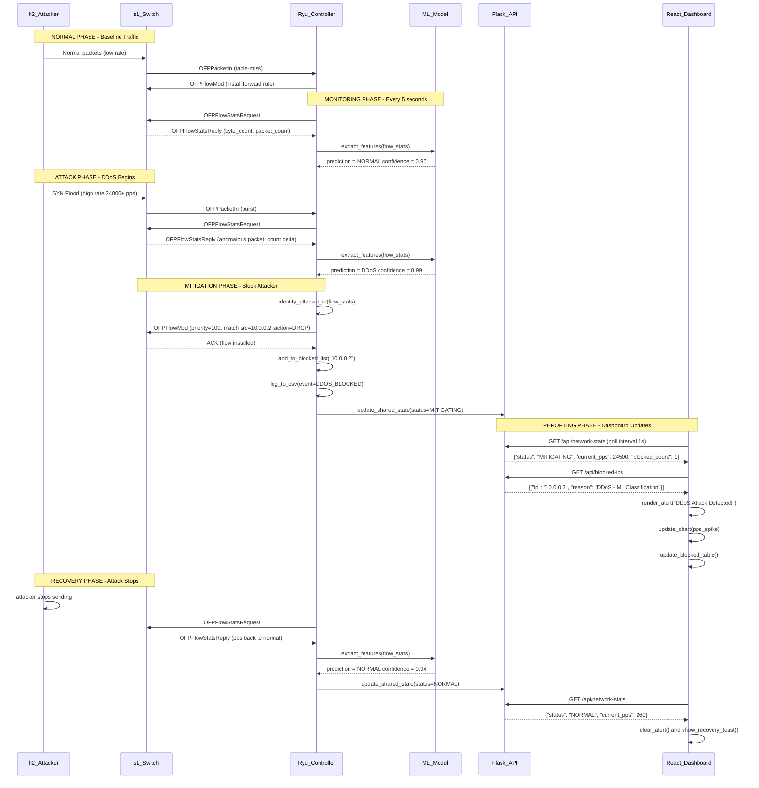
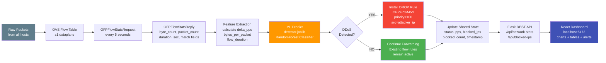
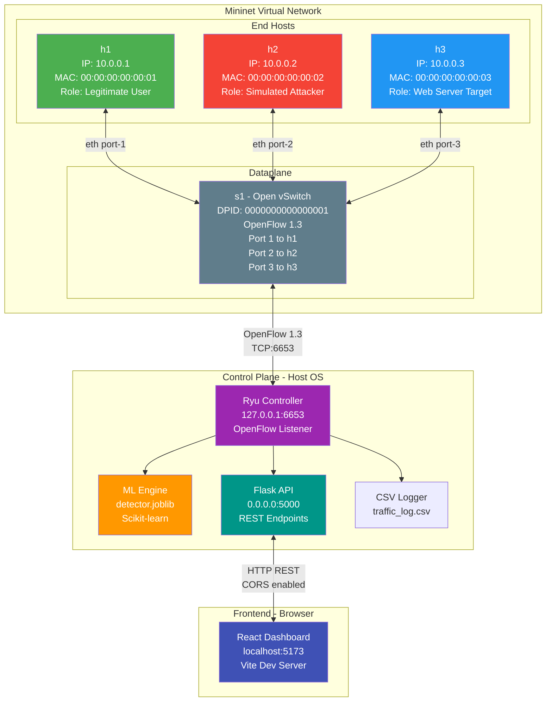
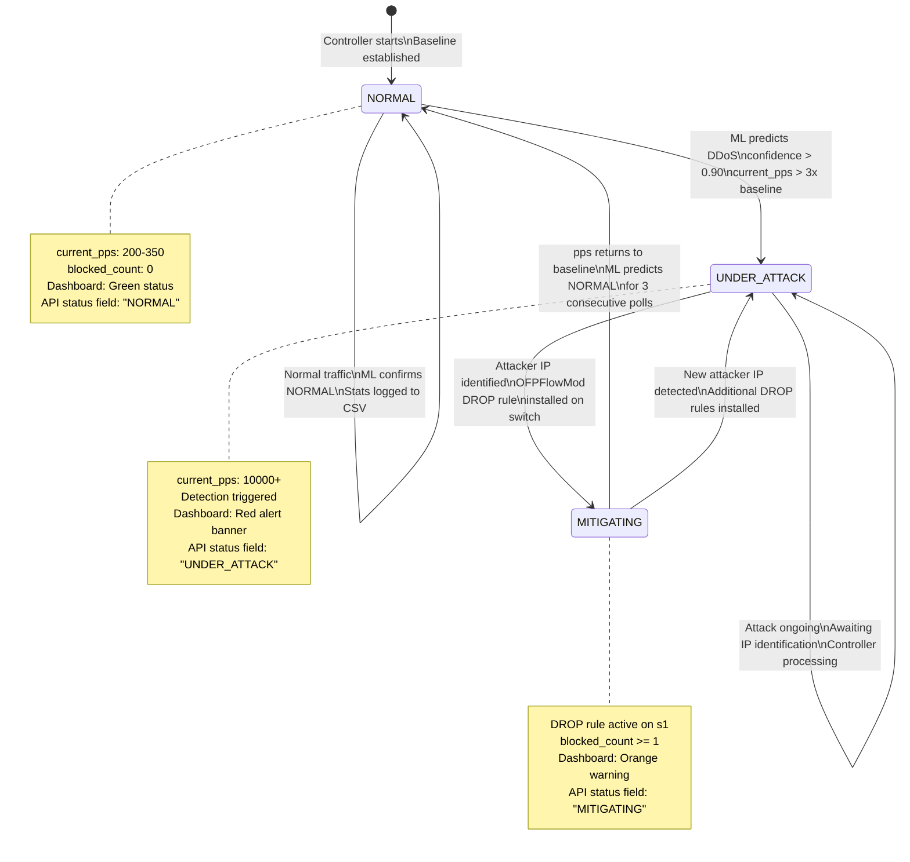

# System Architecture
## SDN-Based DDoS Detection and Mitigation System

> **Document Version:** 1.0  
> **Last Updated:** 2026-09-24  
> **Status:** Active

---

## Table of Contents

1. [Overview](#1-overview)
2. [High-Level Component Diagram](#2-high-level-component-diagram)
3. [Attack Detection Sequence Diagram](#3-attack-detection-sequence-diagram)
4. [Data Flow: Packets to Dashboard](#4-data-flow-packets-to-dashboard)
5. [Network Topology](#5-network-topology)
6. [System State Machine](#6-system-state-machine)
7. [Component Responsibilities](#7-component-responsibilities)

---

## 1. Overview

The system is structured as a **5-layer architecture** that separates concerns cleanly, from raw packet forwarding at the bottom to the user-facing dashboard at the top.

| Layer | Name | Role |
|-------|------|------|
| **L1** | **Virtual Network Layer** | Mininet-emulated hosts and Open vSwitch (OVS) switches generate and forward actual network packets. This is where legitimate traffic and attack traffic both originate. |
| **L2** | **Control Layer** | The Ryu SDN Controller communicates with OVS via the OpenFlow 1.3 protocol. It installs, modifies, and removes flow rules in real time — including DROP rules for attacker IPs. |
| **L3** | **Intelligence Layer** | A pre-trained scikit-learn ML model (`detector.joblib`) runs inside the controller process. It periodically polls flow statistics, extracts features, and classifies traffic as Normal or DDoS. |
| **L4** | **API Layer** | A Flask REST API exposes system state (current PPS, blocked IPs, attack status) to any HTTP consumer. It shares in-process state with the Ryu controller. |
| **L5** | **Presentation Layer** | A React + Vite dashboard polls the Flask API every second and renders live charts, attack alerts, and blocked-IP tables for the operator. |

---

## 2. High-Level Component Diagram

**Key relationships:**
- Both legitimate and attack hosts connect to the same OVS switch `s1`.
- The Ryu controller has **bidirectional** OpenFlow control over `s1` — it can query stats and push flow rules.
- The ML model runs **inside** the controller process (same Python runtime, no IPC needed).
- The Flask API is mounted in the **same Python process** via a background thread, sharing in-process variables with the controller.
- The React dashboard is purely a **consumer** — it reads from the API and never writes to the controller directly.

---

## 3. Attack Detection Sequence Diagram

---

## 4. Data Flow: Packets to Dashboard

---

## 5. Network Topology

---

## 6. System State Machine

---

## 7. Component Responsibilities

| Component | Owner | Input | Output | Technology | File / Location |
|-----------|-------|-------|--------|------------|-----------------|
| **Mininet Topology** | Backend Lead | CLI command `sudo python3 topo.py` | Virtual network with h1, h2, h3, s1 | Python, Mininet | `topo.py` |
| **OVS Switch (s1)** | System (auto) | Raw Ethernet frames from hosts | Forwarded/dropped frames; Flow stats to controller | Open vSwitch, OpenFlow 1.3 | Managed by Mininet |
| **Ryu SDN Controller** | Backend Lead | OpenFlow messages from s1 (PacketIn, FlowStatsReply) | OpenFlow commands (FlowMod), shared state updates | Python, Ryu Framework | `controller.py` |
| **ML Inference Engine** | Backend Lead | Feature vector `[delta_pps, bytes_per_pkt, flow_duration]` | Binary label: `"NORMAL"` or `"DDoS"`, confidence score | scikit-learn, joblib | `detector.joblib`, `train_model.py` |
| **CSV Logger** | Backend Lead | Attack/normal events with timestamps, IPs, PPS values | Append-only CSV rows for post-analysis | Python `csv` module | `traffic_log.csv` |
| **Flask REST API** | Backend Lead | HTTP GET requests from frontend | JSON responses: system stats, blocked IPs | Python, Flask, Flask-CORS | `controller.py` (background thread) |
| **React Dashboard** | Frontend Dev | JSON from Flask API (polled every 1 second) | Rendered charts, tables, alerts in browser | React, Vite, Axios, Recharts | `frontend/src/` |
| **Axios Polling Service** | Frontend Dev | API base URL, polling interval config | Parsed JSON stored in React state | Axios, React useEffect | `frontend/src/hooks/useNetworkStats.js` |
| **Mock Data (Phase 1)** | Frontend Dev | `mockData.json` file | Simulated API responses for UI development | JSON | `frontend/src/mockData.json` |
| **Attack Simulator** | Backend Lead | CLI command in Mininet shell: `h2 hping3 ...` | SYN flood packets from 10.0.0.2 to 10.0.0.3 | hping3 / Python scapy | Run from Mininet CLI |
