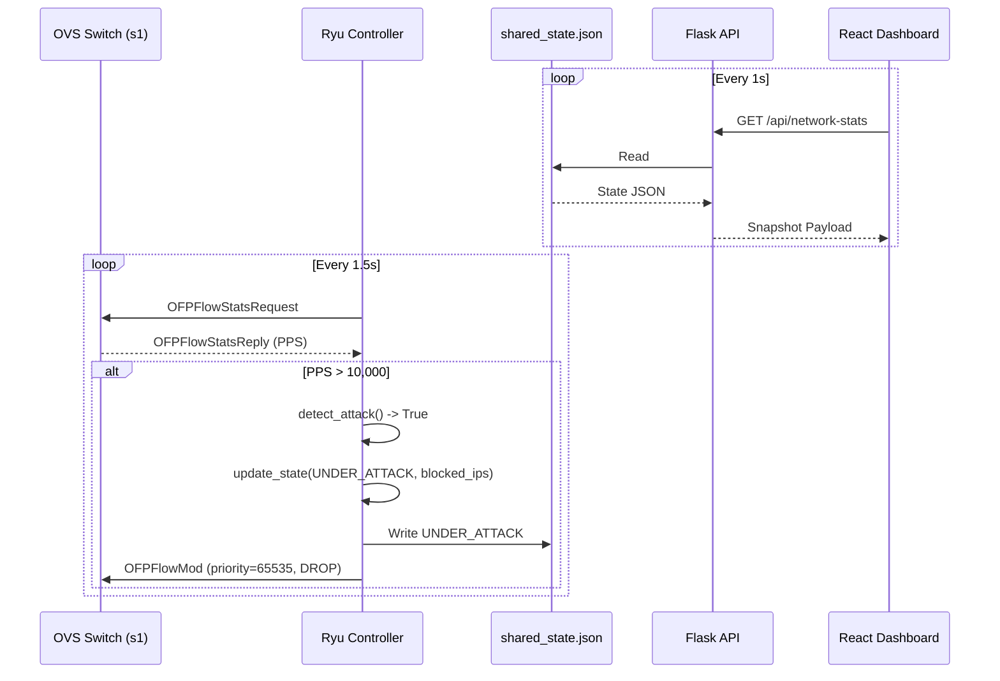
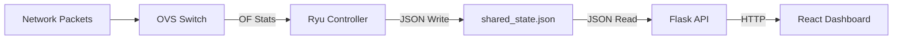
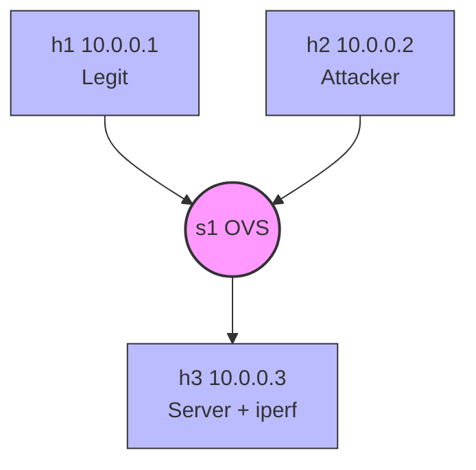
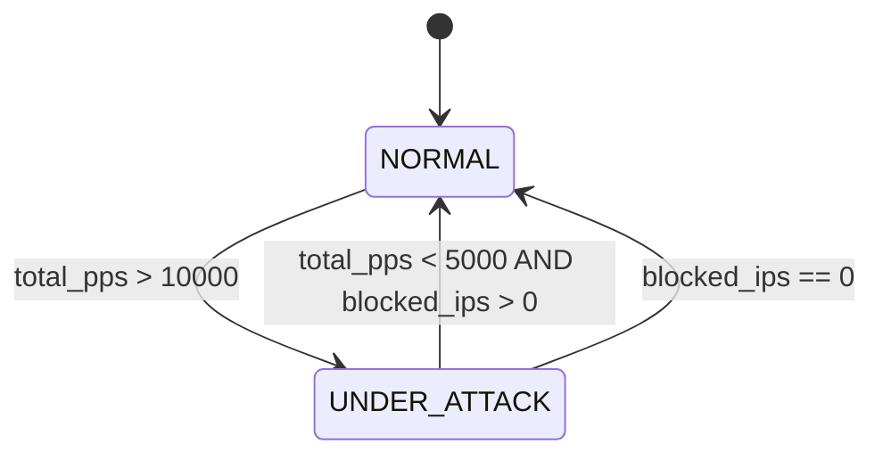

# System Architecture

This document describes the implemented architecture of the SDN DDoS Mitigation project.

## 1. Overview

| Layer | Description |
|---|---|
| **Network (Mininet)** | Emulated environment with 1 switch (s1) and 3 hosts (h1, h2, h3). Handles raw traffic generation. |
| **Control (Ryu)** | OpenFlow 1.3 controller polling switch stats every 1.5s. Manages MAC learning and attack detection. |
| **Detection (ML/Threshold)** | Logic inside Ryu to evaluate flow stats. Uses `detector.joblib` or threshold fallback (> 10k PPS). |
| **Backend (Flask + IPC)** | Flask API serving JSON state to the frontend. IPC is via `shared_state.json` modified by Ryu. |
| **Frontend (React)** | TypeScript React dashboard fetching state every 1s to visualize live network health. |

## 2. High-Level Component Diagram

```mermaid
flowchart TD
    subgraph "Ubuntu VM (192.168.8.147)"
        h1["h1 (10.0.0.1)"] --> s1
        h2["h2 (10.0.0.2)"] --> s1
        s1{"s1 (OVS)"} --> h3["h3 (10.0.0.3)"]
        
        s1 <-->|OpenFlow 1.3| Ryu["Ryu Controller\n(simple_monitor.py)"]
        
        Ryu -->|Writes stats & dataset| CSV["traffic_dataset.csv"]
        Ryu -->|Calls| Inference["Inference Engine\n(inference_loader.py)"]
        Ryu -->|Calls| Mitigation["Mitigation Engine\n(mitigation.py)"]
        Mitigation -->|DROP priority=65535| s1
        
        Ryu -->|Writes (filelock)| StateJSON[/"shared_state.json"\]
        Flask["Flask API\n(app.py)"] -->|Reads| StateJSON
    end
    
    subgraph "Windows Host"
        React["React Dashboard\n(App.tsx)"] -->|HTTP GET| Flask
    end
```

## 3. Attack Detection Sequence Diagram

```mermaid
sequenceDiagram
    participant S as OVS Switch (s1)
    participant R as Ryu Controller
    participant SS as shared_state.json
    participant F as Flask API
    participant UI as React Dashboard

    loop Every 1s
        UI->>F: GET /api/network-stats
        F->>SS: Read
        SS-->>F: State JSON
        F-->>UI: Snapshot Payload
    end

    loop Every 1.5s
        R->>S: OFPFlowStatsRequest
        S-->>R: OFPFlowStatsReply (PPS)
        alt PPS > 10,000
            R->>R: detect_attack() -> True
            R->>R: update_state(UNDER_ATTACK, blocked_ips)
            R->>SS: Write UNDER_ATTACK
            R->>S: OFPFlowMod (priority=65535, DROP)
        end
    end
```

## 4. Data Flow: Packets to Dashboard

```mermaid
flowchart LR
    Packets[Network Packets] --> OVS[OVS Switch]
    OVS -->|OF Stats| Ryu[Ryu Controller]
    Ryu -->|JSON Write| IPC[shared_state.json]
    IPC -->|JSON Read| Flask[Flask API]
    Flask -->|HTTP| Dashboard[React Dashboard]
```

## 5. Network Topology

```mermaid
graph TB
    s1((s1 OVS))
    h1[h1 10.0.0.1\nLegit] --> s1
    h2[h2 10.0.0.2\nAttacker] --> s1
    s1 --> h3[h3 10.0.0.3\nServer + iperf]
    
    classDef switch fill:#f9f,stroke:#333,stroke-width:2px;
    classDef host fill:#bbf,stroke:#333,stroke-width:1px;
    class s1 switch;
    class h1,h2,h3 host;
```
*Note: On startup, `net.pingAll()` auto-runs for MAC learning, and iperf server auto-starts on h3.*

## 6. System State Machine

```mermaid
stateDiagram-v2
    [*] --> NORMAL
    NORMAL --> UNDER_ATTACK : total_pps > 10000
    UNDER_ATTACK --> NORMAL : total_pps < 5000 AND blocked_ips > 0
    UNDER_ATTACK --> NORMAL : blocked_ips == 0
```

## 7. Component Responsibilities

| Component | File Path | Role |
|---|---|---|
| Ryu App | `controller/simple_monitor.py` | Core SDN logic, OF polling every 1.5s, triggering state updates. |
| Mitigation | `controller/mitigation.py` | Installs DROP rules (priority=65535, idle=300s, hard=600s). |
| Flask API | `backend_api/app.py` | Exposes REST endpoints serving data from IPC state. |
| State | `backend_api/shared_state.json` | Inter-Process state sync via filelock. |
| React UI | `src/App.tsx` | Visualizes state, handles smooth 48-point charts and threats table. |

*Last Updated: 2026-10-09*
