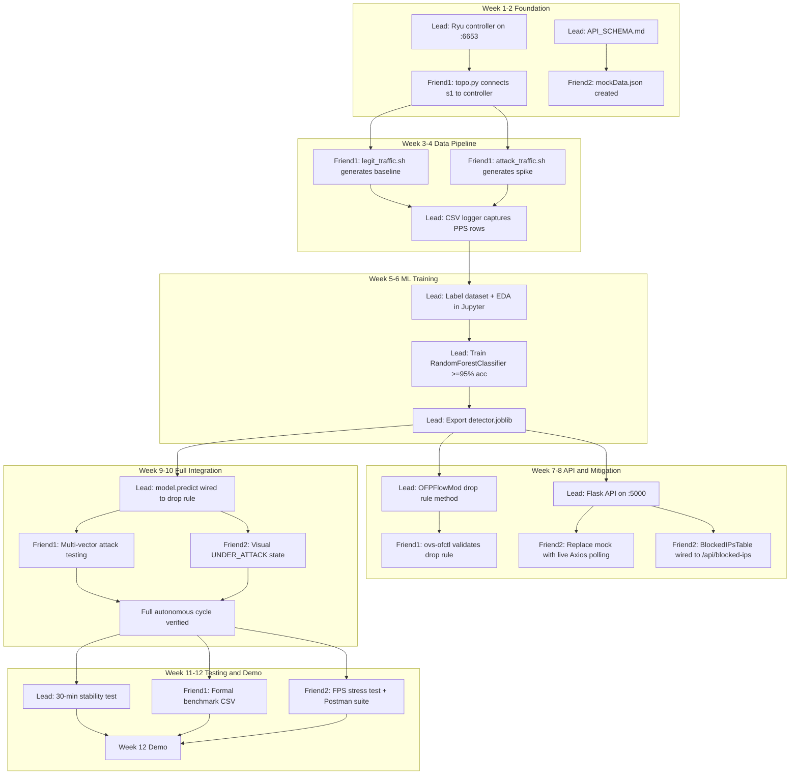

# Team Plan & Responsibility Matrix
## SDN-Based DDoS Detection and Mitigation System

---

## Team Overview

| Member | Role Title | Mission | Owns | Does NOT Touch |
|---|---|---|---|---|
| **Lead (You)** | Backend & ML Engineer | Build the brain — Ryu controller logic, ML detection pipeline, and Flask API | `/controller/`, `/backend_api/`, `/ml_pipeline/` | `/network/`, `/dashboard/` |
| **Friend 1** | Network & Traffic Engineer | Build the arena — virtual topology and traffic scripts | `/network/` | `/controller/`, `/backend_api/`, `/ml_pipeline/`, `/dashboard/` |
| **Friend 2** | Frontend & QA Engineer | Build the eyes — React dashboard and integration tests | `/dashboard/` | `/controller/`, `/backend_api/`, `/ml_pipeline/`, `/network/` |

---

## Lead Developer (You) — Backend & ML Engineer

**Mission:** Build and wire together the Ryu controller, ML detection engine, and Flask REST API.

### Tech Stack to Install

| Package | Install Command | Verify |
|---|---|---|
| Python 3.8+ | System / pyenv | `python3 --version` |
| pip | Comes with Python | `pip --version` |
| Ryu SDN Framework | `pip install ryu` | `ryu-manager --version` |
| Scikit-Learn | `pip install scikit-learn` | `python3 -c "import sklearn; print(sklearn.__version__)"` |
| Pandas | `pip install pandas` | `python3 -c "import pandas; print(pandas.__version__)"` |
| NumPy | `pip install numpy` | `python3 -c "import numpy; print(numpy.__version__)"` |
| Joblib | `pip install joblib` | `python3 -c "import joblib; print(joblib.__version__)"` |
| Flask | `pip install flask` | `python3 -c "import flask; print(flask.__version__)"` |
| Flask-CORS | `pip install flask-cors` | `python3 -c "import flask_cors; print('OK')"` |
| Jupyter Notebook | `pip install jupyter` | `jupyter --version` |

> **Tip:** Create a virtual environment first: `python3 -m venv venv && source venv/bin/activate`

---

### What You DELIVER to Teammates

| Deliverable | Recipient | Due |
|---|---|---|
| Ryu controller running on port **6653** (switch connects to it) | Friend 1 | Week 1 |
| `API_SCHEMA.md` — full JSON contract for every endpoint | Friend 2 | Day 1 of Week 1 |
| Mitigation drop rules that block `h2` when attack is detected | Friend 1 | Week 7 |
| Flask API live on `localhost:5000` | Friend 2 | Week 7 |

---

### What You RECEIVE from Teammates

| Input | From | Expected By |
|---|---|---|
| Confirmation `topo.py` is running and connecting to your controller | Friend 1 | Week 2 |
| Raw CSV data (your logger captures it when their traffic scripts run) | Friend 1 | Week 4 |
| Bug reports on API response format/content | Friend 2 | Week 7 onward |

---

### Week-by-Week Tasks with Acceptance Criteria

#### Week 1 — Environment & Controller Bootstrap
- **Tasks:**
  - Set up Python virtual environment
  - Install all packages from tech stack above
  - Run Ryu with `simple_switch_13.py` to verify installation
  - Draft `API_SCHEMA.md` and share with Friend 2
- **Acceptance Criteria:** Ryu console logs `OFPStateChange` when `s1` connects from Friend 1's topology

---

#### Week 2 — Flow Stats Polling
- **Tasks:**
  - Implement `OFPFlowStatsRequest` polling loop
  - Poll every 1–2 seconds using Ryu's hub or eventlet
  - Print parsed stats to console (src_ip, dst_ip, packet_count, byte_count)
- **Acceptance Criteria:** Ryu prints flow stats in console every ~1.5 seconds reliably

---

#### Week 3 — CSV Logger
- **Tasks:**
  - Build CSV logger that appends a new row every poll cycle
  - Columns: `timestamp`, `src_ip`, `dst_ip`, `packet_count`, `byte_count`, `duration_sec`, `pps`, `bps`
  - Calculate `pps = packet_count / duration_sec` and `bps = byte_count / duration_sec`
- **Acceptance Criteria:** CSV file (`traffic_log.csv`) grows with new rows every ~1 second

---

#### Week 4 — First Coordinated Data Capture
- **Tasks:**
  - Coordinate session with Friend 1 to run `legit_traffic.sh` and `attack_traffic.sh`
  - Ensure logger captures both traffic types
  - Verify CSV has meaningful variation in PPS values
- **Acceptance Criteria:** CSV contains both baseline rows (100–300 PPS) and attack rows (>20,000 PPS), ready for labeling

---

#### Week 5 — Dataset Preparation & EDA
- **Tasks:**
  - Label CSV dataset manually: `0 = Normal`, `1 = DDoS`
  - Load into Jupyter Notebook using Pandas
  - Plot histograms of PPS, BPS, packet_count grouped by label
  - Check for class imbalance; resample if needed
- **Acceptance Criteria:** Histogram clearly shows separation between normal and attack PPS distributions; dataset has >=10,000 labeled rows

---

#### Week 6 — ML Model Training
- **Tasks:**
  - Train `RandomForestClassifier` on labeled dataset
  - Use 80/20 train/test split
  - Tune hyperparameters: `n_estimators`, `max_depth`, `min_samples_split`
  - Export model with `joblib.dump(model, 'detector.joblib')`
- **Acceptance Criteria:** >=95% accuracy on test split; False Positive Rate < 2%; model file exported successfully

---

#### Week 7 — Mitigation Drop Rules
- **Tasks:**
  - Implement `OFPFlowMod` method to install a drop rule for attacker source IP
  - Set high priority (e.g., priority=100) to override forwarding rules
  - Test manually by calling the method directly
- **Acceptance Criteria:** `ovs-ofctl dump-flows s1` shows a high-priority drop rule for `h2`'s IP (`10.0.0.2`)

---

#### Week 8 — Flask REST API
- **Tasks:**
  - Build Flask app with two endpoints:
    - `GET /api/network-stats` -> returns current traffic stats and system status
    - `GET /api/blocked-ips` -> returns array of currently blocked IPs
  - Add Flask-CORS with origin `http://localhost:5173`
  - Shared state between Ryu thread and Flask thread (use thread-safe dict or queue)
- **Acceptance Criteria:** `curl localhost:5000/api/network-stats` returns valid JSON with all required fields; CORS header present

---

#### Week 9 — End-to-End ML Integration
- **Tasks:**
  - Load `detector.joblib` at Ryu controller startup
  - On each polling cycle, extract features and call `model.predict()`
  - If `1 (DDoS)` detected, automatically call the `OFPFlowMod` drop method
  - Log `"DDoS Detected -- blocking <ip>"` to console
- **Acceptance Criteria:** Attack is auto-blocked within **3 seconds** of starting, without any manual command

---

#### Week 10 — Full Cycle Integration Testing
- **Tasks:**
  - Run complete cycle: attack -> detect -> block -> verify UI -> stop attack -> verify recovery
  - Test with all three vector types: SYN flood, UDP flood, ICMP flood
  - Fix any race conditions or threading issues
- **Acceptance Criteria:** All three attack vectors are detected and blocked autonomously; dashboard reflects correct state throughout

---

#### Week 11 — Stability & Performance Testing
- **Tasks:**
  - Run Ryu + Flask under continuous synthetic load for **30 minutes**
  - Log memory usage, CPU usage, thread count, and exception count
  - Measure ML inference latency using Python's `timeit`
- **Acceptance Criteria:** Zero crashes over 30 minutes; inference latency < 5ms per prediction

---

#### Week 12 — Demo Support & Documentation Cleanup
- **Tasks:**
  - Write/update `README.md` with setup and run instructions
  - Finalize `requirements.txt`
  - Commit `detector.joblib` (or add `.gitignore` exception)
  - Rehearse demo with teammates twice
  - Be available to restart controller during demo if needed

---

## Friend 1 — Network & Traffic Engineer

**Mission:** Build the virtual battlefield using Mininet and write the scripts that simulate both legitimate users and attackers.

### Tech Stack to Install (on Ubuntu VM)

| Package | Install Command | Verify |
|---|---|---|
| Ubuntu 20.04 or 22.04 LTS | VirtualBox / VMware | `lsb_release -a` |
| Mininet | `sudo apt install mininet` | `sudo mn --version` |
| Open vSwitch | `sudo apt install openvswitch-switch` | `ovs-vsctl --version` |
| hping3 | `sudo apt install hping3` | `hping3 --version` |
| iperf | `sudo apt install iperf` | `iperf --version` |
| Python 3 | Pre-installed on Ubuntu | `python3 --version` |

> **Note:** All Mininet commands require `sudo`. Run topology scripts as root.

---

### What You DELIVER to Teammates

| Deliverable | Recipient | Due |
|---|---|---|
| Running Mininet topology (`topo.py`) connecting `s1` to Ryu on port **6653** | Lead | Week 2 |
| Raw network traffic (scripts generate data that Lead's logger captures) | Lead | Week 3–4 |
| Labeled timing info: which minutes were normal vs attack | Lead | Week 4–5 |
| Live `hping3` attack on cue during Week 11 testing and Week 12 demo | Lead + Friend 2 | Week 11–12 |

---

### What You RECEIVE from Teammates

| Input | From | When Needed |
|---|---|---|
| Ryu controller must be running on `127.0.0.1:6653` before running `topo.py` | Lead | Before every session |
| Confirmation when drop rules are installed (so you can verify with `ovs-ofctl`) | Lead | Week 7 onward |

---

### Week-by-Week Tasks with Acceptance Criteria

#### Week 1 — Ubuntu VM & Mininet Setup
- **Tasks:**
  - Install Ubuntu VM (VirtualBox recommended — set >=4 GB RAM, >=20 GB disk)
  - Install Mininet, OVS, hping3, iperf
  - Run default Mininet test
- **Acceptance Criteria:** `sudo mn --test pingall` completes with **100% packet success** in default topology

---

#### Week 2 — Custom Topology (`topo.py`)
- **Tasks:**
  - Write `topo.py` that creates:
    - `h1` at `10.0.0.1` (legitimate client)
    - `h2` at `10.0.0.2` (attacker)
    - `h3` at `10.0.0.3` (server)
    - `s1` connected to remote controller at `127.0.0.1:6653`, OpenFlow 1.3
  - Start `SimpleHTTPServer` on `h3` as background process
- **Acceptance Criteria:** `sudo python3 topo.py` launches Mininet CLI; `h1 ping h3` succeeds; Ryu console shows `OFPStateChange`

---

#### Week 3 — Legitimate Traffic Script (`legit_traffic.sh`)
- **Tasks:**
  - Write `legit_traffic.sh` that uses `iperf` client from `h1` to `h3` in a continuous loop
  - Keep traffic realistic: moderate, steady rate
- **Acceptance Criteria:** Steady **100–300 PPS** visible in Ryu console logs; CSV rows show expected `pps` range

---

#### Week 4 — Attack Traffic Script (`attack_traffic.sh`)
- **Tasks:**
  - Write `attack_traffic.sh` that runs from `h2`:
    ```bash
    hping3 --flood --udp -p 80 10.0.0.3
    ```
  - Test that it saturates the link
- **Acceptance Criteria:** PPS spikes to **>20,000** visible in Ryu logs; Lead's CSV captures the spike

---

#### Weeks 5–6 — Data Collection Sessions
- **Tasks:**
  - Coordinate with Lead to run multi-session data captures
  - Run `legit_traffic.sh` for 10–15 minutes, then `attack_traffic.sh` for 5–10 minutes, repeat
  - Note timestamps of each phase and pass them to Lead for labeling
- **Acceptance Criteria:** Lead's CSV reaches >=10,000 labeled rows across normal and attack periods

---

#### Weeks 7–8 — Mitigation Validation
- **Tasks:**
  - Run `attack_traffic.sh` from `h2`
  - Wait for Lead's drop rule to install (<=3 seconds)
  - Run `ovs-ofctl dump-flows s1` to confirm drop rule exists
  - Simultaneously `ping h3` from `h1` and measure packet loss
- **Acceptance Criteria:** `h1` packet loss **< 5%** while `h2` is fully blocked

---

#### Weeks 9–10 — Multi-Vector Attack Testing
- **Tasks:**
  - Test three attack vectors from `h2`:
    - **UDP flood:** `hping3 --flood --udp -p 80 10.0.0.3`
    - **SYN flood:** `hping3 --flood --syn -p 80 10.0.0.3`
    - **ICMP flood:** `hping3 --flood --icmp 10.0.0.3`
  - Record detection time for each vector
- **Acceptance Criteria:** Each vector is independently detected and blocked within 3 seconds

---

#### Week 11 — Formal Benchmarking
- **Tasks:**
  - Run 3 formal attack runs with clean measurements:
    - Time from `attack_traffic.sh` execution to `ovs-ofctl` showing drop rule
    - `h1` packet loss percentage during each run
    - Throughput measurement before and during attack (use `iperf -s` on `h3`)
  - Export results to `benchmarks/network_results.csv`
- **Acceptance Criteria:** Results CSV committed with >=3 runs per vector; all results documented

---

#### Week 12 — Demo Orchestration
- **Tasks:**
  - Set up Mininet topology on demo machine in advance
  - Rehearse attack launch sequence twice
  - Execute attack on examiner's cue during demo
  - Have backup VM snapshot ready to restore in 2 minutes if needed

---

## Friend 2 — Frontend & QA Engineer

**Mission:** Build the React dashboard that visually proves the system is working, and verify that all components integrate correctly end-to-end.

### Tech Stack to Install

| Package | Install Command | Verify |
|---|---|---|
| Node.js 18+ | Download from nodejs.org | `node --version` (must show v18+) |
| npm | Comes with Node.js | `npm --version` |
| VS Code | Download from code.visualstudio.com | Open and check version |
| Postman | Download from postman.com | Launch and create workspace |
| Browser DevTools | Built into Chrome/Firefox | Press F12 in browser |

---

### What You DELIVER to Teammates

| Deliverable | Recipient | Due |
|---|---|---|
| Bug reports on API response format/content issues | Lead | Week 7 onward |
| Integration test results showing system works end-to-end | Everyone | Week 10–11 |
| Postman collection with all API tests documented | Everyone | Week 11 |

---

### What You RECEIVE from Teammates

| Input | From | When Available |
|---|---|---|
| `API_SCHEMA.md` — full JSON contract (build `mockData.json` from this) | Lead | Day 1 of Week 1 |
| Flask API running on `localhost:5000` | Lead | Week 7 |
| Live `hping3` attack for UI stress testing | Friend 1 | Week 11 |

---

### Week-by-Week Tasks with Acceptance Criteria

#### Week 1 — Project Scaffold
- **Tasks:**
  - Create Vite + React project:
    ```bash
    npm create vite@latest dashboard -- --template react
    cd dashboard && npm install
    ```
  - Install and configure Tailwind CSS
  - Read `API_SCHEMA.md` from Lead; create `src/mockData.json`
- **Acceptance Criteria:** `localhost:5173` shows a blank styled page with Tailwind base styles applied

---

#### Week 2 — Component Shells
- **Tasks:**
  - Build three placeholder components:
    - `TrafficLineChart.jsx` — empty chart card
    - `SystemHealthBadge.jsx` — status badge component
    - `BlockedIPsTable.jsx` — table component
  - Arrange in a responsive grid layout
- **Acceptance Criteria:** Three visible placeholder cards rendered on screen at `localhost:5173`

---

#### Week 3 — Animated Chart with Mock Data
- **Tasks:**
  - Install Recharts: `npm install recharts` (or Chart.js equivalent)
  - Wire `TrafficLineChart` to consume a mock data array
  - Use `setInterval` to push new data points every 1 second, simulating live feed
- **Acceptance Criteria:** Chart animates smoothly with mock PPS data; no console errors

---

#### Week 4 — Complete Mock Dashboard
- **Tasks:**
  - Build `BlockedIPsTable` with red `DROPPED` badges for each blocked IP row
  - Build `SystemHealthBadge` with three visual states: `NORMAL` (green), `UNDER_ATTACK` (red), `MITIGATING` (amber)
  - Wire all states via hardcoded values for now
- **Acceptance Criteria:** All three components render correctly with mock data; all badge states visible by toggling hardcoded value

---

#### Weeks 5–6 — Live API Integration
- **Tasks:**
  - Install Axios: `npm install axios`
  - Replace `setInterval` mock with real Axios polling to `GET /api/network-stats` every 1 second
  - Wire `SystemHealthBadge` to `status` field from API response
  - Handle API not-yet-running gracefully (no crashes, show "Offline" state)
- **Acceptance Criteria:** When Lead runs Flask, badge updates automatically from API; chart shows live PPS values

---

#### Weeks 7–8 — Blocked IPs & Memory Safety
- **Tasks:**
  - Wire `BlockedIPsTable` to `GET /api/blocked-ips` polling every 2 seconds
  - Ensure chart buffer only keeps the **last 30 data points** (prevent memory leak on long runs)
  - Add loading spinner while waiting for first API response
- **Acceptance Criteria:** Blocked IPs table populates with `h2`'s IP when attack runs; no memory growth over 30-minute session

---

#### Weeks 9–10 — Visual States & Error Handling
- **Tasks:**
  - Add pulsing red header/border animation when status is `UNDER_ATTACK`
  - Add toast notification: **"Controller Offline"** when API returns 503 or network error
  - Implement auto-retry logic (exponential backoff, max 5 retries)
  - Add green recovery animation when status returns to `NORMAL`
- **Acceptance Criteria:** Visual states switch correctly and promptly; offline toast appears and retries; no white-screen crashes

---

#### Week 11 — QA & Stress Testing
- **Tasks:**
  - Build and run Postman collection validating:
    - Schema correctness of all API fields
    - Correct HTTP status codes
    - CORS headers present
  - Open browser DevTools -> Performance tab; record FPS during live `hping3` flood
  - Test "API disconnect" scenario by stopping Flask mid-session
- **Acceptance Criteria:** 60 FPS maintained during flood; no white-screen crashes; Postman tests all pass; disconnect scenario handled gracefully

---

#### Week 12 — Final Polish & Demo Prep
- **Tasks:**
  - Ensure fully responsive layout (works on both laptop and projector resolution)
  - Remove all `console.log` debug statements
  - Final demo dry runs with teammates
  - Prepare fallback: pre-recorded 2-minute screen capture of dashboard in action

---

## Dependency Map



---

> **Golden Rule:** No one edits code outside their assigned folder. If a cross-cutting change is needed, it is discussed in team standup, and the folder owner makes the change.
